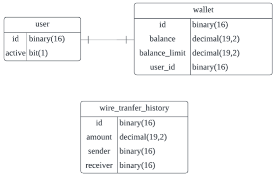

## 요구사항 정리

### 유저

- [x] 현재 유저는 가입상태거나 탈퇴일 수 있습니다.

### 지갑

- [x] 지갑은 가질 수 있는 한도 금액이 존재한다.
    - [x] 한도는 지갑마다 다를 수 있다.
- [x] 각 유저는 현재 가지고 있는 금액을 저장하고 있습니다.
- [x] 지갑은 다른 지갑으로 송금할 수 있다.
    - [x] 한도가 넘을 경우 해당 송금은 실패해야 합니다.
- [x] 특정 유저에 대한 송금내역을 확인할 수 있다.
- [x] 송금의 취소는 발생하지 않습니다.
- [x] 금액을 충전할 수 있다.
  - [x] 한도금액을 초과하는 만큼은 금액 충전을 할 수 없다.


---
## 용어 정리

### 유저

- 유저 | user | 서비스를 사용하는 사람
- 활성 상태 | active | 사용자가 가입하여 서비스를 이용할 수 있는 상태
- 탈퇴 상태 | inactive | 사용자가 가입하였지만 탈퇴하여 서비스를 이용할 수 없는 상태

### 지갑

- 지갑 | wallet | 유저가 금액을 보관할 수 있는 수단
- 한도 금액 | balance limit | 지갑에서 가질 수 있는 최대 금액
- 잔액 | balance | 지갑에 남아있는 금액
- 송금 | wire transfer | 지갑에 있는 금액을 다른 지갑으로 금액을 전송함
- 송금자 | sender | 돈을 보내는 사람
- 수취자 | receiver | 돈을 받는 사람
- 송금 금액 | wire transfer amount | 송금하는 금액
- 송금 내역 | wire transfer history | 송금을 했던 내역
- 금액 충전 | deposit money | 지갑에 금액을 채워 넣음

---
## 모델링

### 유저(User)

- `User`는 `Active`상태 이거나 `Deactive`상태 일 수 있다.

### 지갑(Wallet)

#### 속성

- `Wallet`은 `Balance`를 가지고 있다.
- `Wallet`은 `Balance Limit`가 존재한다.

#### 기능

- `Wallet`은 다른 `Wallet`으로 `Wire Transfer Amount`만큼  `Wire Transfer`할 수 있다.
- `Balance Limit`가 초과할 경우 `Wire Transfer`은 실패해야 한다.
- `Balance`는 0원 이상이어야 한다.
- 특정 `User`에 대한 `Wire Transfer History`를 확인할 수 있다.
- `Wire Transfer` 취소는 발생하지 않습니다.
- `Deposit Money`를 할 수 있다.
- `Deposit Money` 시에 `Balance Limit`를 초과해서는 안된다.

---

## 퀵 스타트

```sh
cd docker
docker  docker-compose -p lemontree up -d 
```

명령어로 db 실행

---

## API 설명

### 송금 API
/api/v1/wallet/transfer (POST)

Request Body
```
{
  "senderUserId": "userId",
  "wireTransferAmount": "wireTransferAmount",
  "receiverUserId": "receiverUserId"
}
```
| 필드명 | 타입 | 설명      |
|-----|----|---------|
| senderUserId | UUID | 송금자의 ID |
| wireTransferAmount | BigDecimal | 송금 금액   |
| receiverUserId | UUID | 수취자의 ID |


### 송금내역 API
/api/v1/user/{userId}/wire-transfer-history (GET)

Path Variable

| path 명 | 타입 | 설명             |
|--| -- |----------------|
| userId | UUID | 금액 충전하는 유저의 ID |

### 금액 충전 API
/api/v1/wallet/deposit (POST)

Request Body
```
{
  "senderUserId": "userId",
  "wireTransferAmount": "wireTransferAmount",
  "receiverUserId": "receiverUserId"
}
```
| 필드명 | 타입 | 설명          |
|-----|----|-------------|
| userId | UUID | 충전하는 유저의 ID |
| depositMoneyAmount | BigDecimal | 충전 금액       |

---

* DB



---

- 발생할 수 있는 위험 요소

동시성 이슈가 발생하여 지갑이 가질 수 있는 금액을 초과할 수 있게 된다.
이걸 방지하기 위해서 Pessimistic lock을 통해 방지 하였습니다.

하지만 Pessimistic lock을 걸게 되면 문제점이 발생할 수 있는데

1. 데드락이 발생할 수 있다.
2. 요청이 몰리게되면 다른 요청들은 모두 blocking 되므로 타임아웃이 발생할 수 있습니다.

- 해결 방안

다른 Lock 방식도 있지만 결과적으로 DB에 의존해 장애가 발생하면 모든 시스템에 영향을 주게 됩니다.

그래서 고성능인 Redis를 사용하여 해결할 수 있습니다.

키 값으로 락 유무를 판단하고 접근하도록 만들어 동시성 이슈를 해결할 수 있습니다.

mysql을 그대로 사용하면 추가적인 비용은 들지 않겠지만 대규모로 요청이 들어왔을 때 위험 요소들이 발생할 수 있고

Redis를 도입하면 추가적으로 도입 비용이 들지만 성능적으로 우수합니다.